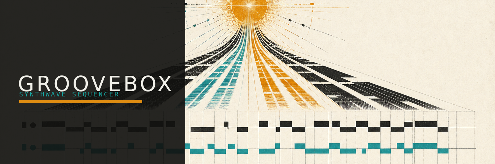

# Groovebox

Eine vollständig clientseitige Synthwave-Groovebox für musikalische
Einsteiger. Vier Szenen, fünf Instrumente und ein 4×16-Step-Sequencer laufen
direkt im Browser. Drei kuratierte Klangfarben je Instrument sowie Kick,
Snare, Clap, Closed/Open Hat und Tom werden lokal mit Tone.js synthetisiert.

**Live:** https://theanonymous.github.io/Groovebox/



Weitere Motive stehen als [quadratisches Artwork](public/assets/promo/groovebox-square-v2.png),
[Hochformat](public/assets/promo/groovebox-portrait-v2.png) und
[Social-Preview](public/assets/social/groovebox-preview.png) bereit. Der
[Preset-Atlas](public/assets/promo/preset-atlas-v3.png) zeigt zusätzlich alle 15
Klangfarben. Szenen-, Instrument- und Presetgrafiken werden direkt in der
Anwendung verwendet.

## Entwicklung

```bash
npm install
npm run dev
npm test
npm run build
npm run test:e2e
npm run test:audio
```

Für die lokale Hörabnahme startet `npm run audio:lab` das nicht im
GitHub-Pages-Build enthaltene Sound-Lab ausschließlich auf
`http://127.0.0.1:4174/audio-lab.html`. Es rendert den Produktionssignalweg
offline, bietet A/B-Hörpegelabgleich und zeigt Peak, RMS, Crest-Faktor,
Bandenergie, Stereokorrelation und Ausklingzeit an; einen Audioexport gibt es
bewusst nicht.

Die App benötigt keine Konten, kein Backend und lädt zur Laufzeit keine
Ressourcen von fremden Origins. Projekte werden nur in `localStorage` des
aktuellen Browserprofils gespeichert. V1-Projekte werden automatisch nach V2
migriert; die V1-Daten bleiben dabei als Rückfalloption unangetastet.
Unterstützt wird eine Desktop-Fläche ab 1024×720 Pixeln.

## Bedienung

- `Leertaste`: Start/Stop
- `1`–`5`: Spur wählen
- `Umschalt+1`–`4`: Szene wählen oder für den nächsten Takt vormerken
- `V`: Pattern variieren, `R`: neues typisches Pattern
- `Strg+Z` / `Strg+Umschalt+Z`: Rückgängig/Wiederholen
- `Umschalt+Entf`: aktive Spur leeren

Die vendorte BraunUi-Version und ihre Lizenzen sind in
[`THIRD_PARTY_NOTICES.md`](THIRD_PARTY_NOTICES.md) dokumentiert.

Jeder Push auf `main` wird nach erfolgreichen Unit-Tests automatisch über
GitHub Pages veröffentlicht.
