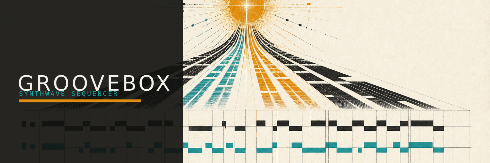

# Groovebox

Eine vollständig clientseitige Synthwave-Groovebox für musikalische
Einsteiger. Vier Szenen, fünf Instrumente und ein 4×16-Step-Sequencer laufen
direkt im Browser. Drei kuratierte Klangfarben je Instrument sowie Kick,
Snare, Clap, Closed/Open Hat und Tom werden lokal mit Tone.js synthetisiert.

**Live:** https://musik.jodie-oesterling.de/Groovebox/ (Teil der
[Musik-Werkstatt](https://musik.jodie-oesterling.de/))



Weitere Motive stehen als [quadratisches Artwork](docs/assets/promo/groovebox-square-v2.png),
[Hochformat](docs/assets/promo/groovebox-portrait-v2.png) und
[Social-Preview](public/assets/social/groovebox-preview.png) bereit. Der
[Preset-Atlas](docs/assets/promo/preset-atlas-v3.png) zeigt zusätzlich alle 15
Klangfarben. Szenen-, Instrument- und Presetgrafiken werden direkt in der
Anwendung verwendet.

## Entwicklung

Die Toolchain ist über [`mise.toml`](mise.toml) festgelegt (Node.js 24.15.0,
npm 12.0.0); `mise install` richtet sie ein.

```bash
npm ci
npm run dev
npm run verify   # Unit-Tests, Build, E2E (Chromium + Firefox), Audio-Verträge
```

Für die lokale Hörabnahme startet `npm run audio:lab` das nicht im
Produktionsbuild enthaltene Sound-Lab ausschließlich auf
`http://127.0.0.1:4174/audio-lab.html`. Es rendert den Produktionssignalweg
offline, bietet A/B-Hörpegelabgleich und zeigt Peak, RMS, Crest-Faktor,
Bandenergie, Stereokorrelation und Ausklingzeit an; das Lab selbst exportiert
nichts. `npm run render:demo` rendert die Hörprobe der Handy-Seite und der
Musik-Werkstatt über den WAV-Export der App neu (braucht ffmpeg).

Die Audio-Engine baut Filter, EQ, Chorus, Hall und die Stimmen der Tone.js-
Instrumente exakt aus nativen Web-Audio-Knoten nach (rund 300 statt 1.650
Knoten), damit Chromium ohne Aussetzer spielt; ein Audiovertrag hält dieses
Budget. Eine Hörentscheidung ist dabei offen: Die alte Engine legte unter die
Hi-Hats eine FM-Schicht, die mit vertauschten Argumenten ausgelöst wurde
(0,1-Hz-Note, Klick vor dem Schlag) und praktisch nicht hörbar war. Sie ist
entfallen, damit sich der hörbare Klang nicht ändert; soll sie als echte
Metall-Schicht zurückkommen, ist das eine bewusste Klangentscheidung.

Die App benötigt keine Konten, kein Backend und lädt zur Laufzeit keine
Ressourcen von fremden Origins. Bis zu acht benannte Projekte liegen im
`localStorage` des aktuellen Browserprofils (Katalog `groovebox.projects.v1`,
je Projekt Primärstand und letzte gültige Sicherung). Beim ersten Start wird ein
vorhandenes Einzelprojekt früherer Versionen (V2 oder V1) als „Mein Set“
übernommen; die alten Schlüssel bleiben als Rückfalloption unverändert.
Projekte lassen sich unter **Projekte** als `.groovebox.json` sichern und
wieder öffnen, auch per Drag & Drop ins Fenster. Importierte Dateien laufen
durch denselben Sanitizer wie gespeicherte Stände.
Groovebox braucht ein Fenster ab 1024 Pixel Breite; darunter erscheint eine
Handy-Seite mit Rückweg zur Musik-Werkstatt.

## Bedienung

- `Leertaste`: Start/Stop
- `1`–`5`: Spur wählen
- `Umschalt+1`–`4`: Szene wählen oder für den nächsten Takt vormerken
- `V`: Pattern variieren, `R`: neues typisches Pattern
- `Strg+Z` / `Strg+Umschalt+Z`: Rückgängig/Wiederholen
- `Umschalt+Entf`: aktive Spur leeren
- `?`: Hilfe mit allen Tastenkürzeln und der Einführungstour

Beim ersten Besuch führt eine kurze Tour durch Start, Szenen, Raster und
Szenenfolge. Tonart und Skala (Moll, Dur, Dorisch, Moll-Pentatonik) gelten für
das ganze Set; die Akkordstufen heißen je Skala richtig (Dur: I ii iii IV V vi
vii°). Solange Musik läuft, bleibt der Bildschirm an.

**Vom Loop zum Track:** Mit **Szenenfolge an** spielen Auftakt, Fahrt,
Höhepunkt und Ausklang nacheinander, jede Szene 4, 8 oder 16 Takte lang.
**Als WAV exportieren** rendert den ganzen Bogen oder eine Szene als Loop durch
dieselbe Engine wie die Wiedergabe, schneller als in Echtzeit. **Link teilen**
packt das Set komprimiert in den Teil der Adresse hinter `#`; er wird nie an den
Server geschickt, und wer ihn öffnet, übernimmt eine eigene Kopie.

**Im Raster:** Jeder Step hat eine **Chance** (100, 75, 50 oder 25 %), die bei
jedem Durchlauf neu würfelt, und Drums, Bass und Lead eine **Wiederholung**
(2–4 schnelle Schläge im Step). Jede Spur kann eine eigene **Spurlänge**
bekommen (12–60 Steps); sie läuft gegen die vier Takte der Szene weiter und
verschiebt sich dabei (Polymetrik).

**Live spielen:** Die Live-Leiste nimmt mit **Aufnahme** (`A`) auf, was du
hörst, und speichert es als WAV. Mit **Live-Tasten** (`P`) schalten `1`–`5`
Spuren am nächsten Takt stumm. Der **Filter** federt beim Loslassen zurück
(`F` halten schließt, `Umschalt+F` öffnet). **Break → Drop** (`B` halten) nimmt
Kick und Bass heraus und lässt einen Hochpass steigen; beim Loslassen kommt der
Drop am nächsten Takt. Nichts davon landet im Projekt oder in der Undo-Liste.

**Gleichtakt:** Ist Kitty in einem zweiten Tab offen und dort wie hier
**Gleichtakt** an, starten und stoppen beide gemeinsam; wer startet, gibt das
Tempo vor, die andere App verdoppelt oder halbiert es bei Bedarf. **Stems**
im Export-Dialog liefern jede Spur als eigene WAV-Datei in einem ZIP.

**MIDI** (Chrome, Edge; Firefox nach Nachfrage): Die Groovebox hört nur zu. Eine
MIDI-Clock gibt Tempo, Start und Stop vor, ohne das Tempo des Sets zu ändern;
die Regler CC 70–74 steuern die fünf Makros der gewählten Spur, jeder Regler
lässt sich im MIDI-Dialog neu zuweisen. Eine Drehbewegung ist ein Undo-Schritt.

Die vendorte BraunUi-Version und ihre Lizenzen sind in
[`THIRD_PARTY_NOTICES.md`](THIRD_PARTY_NOTICES.md) dokumentiert.

## Veröffentlichung

Groovebox läuft unter `/Groovebox/` auf dem eigenen Server. Veröffentlicht wird
nur ein Commit auf `main`: `scripts/musik-build.sh` im Repository
`server-infra-nixos` exportiert ihn per `git archive`, führt `npm run verify`
aus und baut zusammen mit Kitty und der Übersichtsseite ein Release;
`scripts/musik-deploy.sh` schaltet es atomar um und prüft jede Datei über HTTPS,
`scripts/musik-rollback.sh` kehrt zum vorherigen Release zurück.

<!-- github-cicd-policy -->
## Local validation policy

This repository does not use GitHub Actions or any other GitHub-hosted CI/CD. Run tests, linters, builds, and all other checks locally before merging. A documented successful local test run is sufficient for review and merge.
<!-- /github-cicd-policy -->
